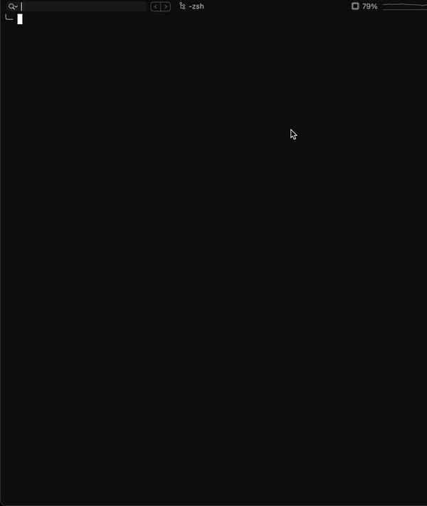

# Nightwatch Schematics

[](https://github.com/nightwatchjs/nightwatch-schematics/actions/workflows/build.yml)
[](https://www.npmjs.com/package/@nightwatch/schematics)

> Fast and easy installation of [Nightwatch][NightwatchLink] into your projects

Framework & Language Supported: [Angular](#angular) | [React](#react) | [Vue](#vue) | [Typescript](#typescript)

<p align="center">
  
</p>

This project is a Schematics implementation that allows you to easily integrate [Nightwatch][NightwatchLink] into your Angular, React, Vue, Typescript projects.

**This Schematic will:**

🏗️ Install Nightwatch, and it's dependencies  
⚙️  Add NPM scripts for running Nightwatch tests  
📦 Scaffold base Nightwatch config and test files  
❓ Prompt for removal of Protractor files and configuration  

## Angular

### ✨ Demo



### 🚀 Usage

Run as one command in an Angular CLI app directory. Note this will add the schematic as a dependency to your project.

```bash
ng add @nightwatch/schematics
```

One can provide following options:
| Option    | Description                                                                                                                                                                                           |
|-----------|-------------------------------------------------------------------------------------------------------------------------------------------------------------------------------------------------------|
| noBuilder | This will skip the builder addition, leaving the angular.json file unmodified and requiring you to run Nightwatch from the command line or through your IDE. Include --noBuilder in your ng add command. |

With the custom builder installed, you can run Nightwatch with the following commands:

```bash
ng e2e
```

```bash
ng run {your-project-name}:nightwatch-run
```

These two commands do the same thing. They will run nightwatch e2e tests.

Once Nightwatch is added to your project, all [Nightwatch CLI options][NightwatchCliOptionsLink] will be available when triggering e2e tests. E.g.: `--verbose`, `--retries` etc.

## React

🚧 Currently, React is not fully supported, but we are working on it.

One can still add Nightwatch to the React projects, please follow Nightwatch [get started][NightwatchGetStartedLink] guide.

## Vue

Vue Cli have plugin [@vue/cli-plugin-e2e-nightwatch][VueNightwatchPluginLink] which can be used to install Nightwatch in Vue projects.

## Typescript

### 🚀 Usage

Install [Schematics CLI][SchematicsCliLink] globally

```bash
npm install -g @angular-devkit/schematics-cli
```

Install [Nightwatch-schematics][NightwatchSchematicsLink] in your project

```bash
npm install @nightwatch/schematics
```

Run following command to install Nightwatch in your project:

```bash
schematics @nightwatch/schematics:ng-add
```

Once Nightwatch is added to your project, all [Nightwatch CLI options][NightwatchCliOptionsLink] will be available when triggering e2e tests. E.g.: `--verbose`, `--retries` etc. One can update `e2e:test` to include cli options.

## 🐛 Issues

Issues with this schematic can filed [here](https://github.com/nightwatchjs/nightwatch-schematics/issues)

If you want to contribute (or have contributed in the past), feel free to add yourself to the list of contributors in the package.json before you open a PR!

## FAQ

### How do I update @nightwatch/schematics package?

This command will update nightwatch schematic package

```bash
npm update @nightwatch/schematics
```

### Where can I ask for help and report bugs?

The best way to ask for help and to report bugs is to [open an issue][GithubIssueLink].

[Gitter][GitterLink] is another option.

### I created new angular project, how do I remove Protractor and install Nightwatch?

It's very simple, you just have to run `ng add @nightwatch/schematics` command, and it will prompt you to remove Protractor from angular project.

### How do I run on another browser that was initially selected in angular app?

All you have to do is install the relevant drivers, and replace `env` value (Check the column names in the [table](#drivers-available-to-install) below) `env-name` in `angular.json`. The config in `angular.json` will look like this.

```javascript
  "nightwatch-run": {
    "builder": "@nightwatch/schematics:nightwatch",
    "options": {
      "devServerTarget": "angularapp:serve",
      "tsConfig": "../nightwatch/tsconfig.e2e.json",
      "config": "./nightwatch.conf.js",
      "env": "<env-name>"
    },
    "configurations": {
      "production": {
        "devServerTarget": "angularapp:serve:production"
      }
    }
  },
  "e2e": {
    "builder": "@nightwatch/schematics:nightwatch",
    "options": {
      "devServerTarget": "angularapp:serve",
      "tsConfig": "../nightwatch/tsconfig.e2e.json",
      "config": "./nightwatch.conf.js",
      "env": "<env-name>"
    },
    "configurations": {
      "production": {
        "devServerTarget": "angularapp:serve:production"
      }
    }
  }
```


### How do I run on another browser that was initially selected in typescript project?

In `package.json`, you will find `e2e:test` in the scripts, and change `env` value. To change the value, You can refer below [table](#drivers-available-to-install)

```json
{
  "e2e:test": "./node_modules/.bin/tsc -p ./nightwatch/tsconfig.e2e.json && ./node_modules/.bin/nightwatch --env '<env-name>' --config './nightwatch.conf.js"
}
```

### How to run e2e tests using npm?

| Projects           | command          |
|--------------------|------------------|
| Angular App        | npm run e2e      |
| Typescript Project | npm run e2e:test |


## Drivers

### Drivers available to install

| Name            | driver          | command                                  |
|-----------------|-----------------|------------------------------------------|
| chrome          | chromedriver    | `npm install chromedriver --save-dev`    |
| firefox         | geckodriver     | `npm install geckodriver --save-dev`     |
| selenium-server | selenium-server | `npm install selenium-server --save-dev` |

## 👩🏽‍💻 Development

### Getting Started

🛠️ [Node.js and npm](https://docs.npmjs.com/downloading-and-installing-node-js-and-npm) are required for the scripts. Make sure it's installed on your machine.

⬇️ **Install** the dependencies for the schematic and the sandbox application

```bash
npm i && cd sandbox && npm i && cd ..
```

🖇 **Link** the schematic in the sandbox to run locally

```bash
npm run link:sandbox
```

🏃 **Run** the schematic

```bash
npm run build:clean:launch
```

## 🧪 E2E Testing

Execute the schematic against the sandbox. It will add Nightwatch config, tests, and custom builder, then run e2e tests in the sandbox.

```bash
npm run test
```

## 🧪 Unit Testing

Run the unit tests using Jasmine as a runner and test framework

```bash
npm run build:test
npm run test:unit
```

## ♻️ Reset the Sandbox

Running the schematic locally performs file system changes. The sandbox is version-controlled so that viewing a diff of the changes is trivial. After the schematic has run locally, reset the sandbox with the following.

```bash
npm run clean
```

---

These projects: [@briebug/cypress-schematic](https://github.com/briebug/cypress-schematic/), [schuchard/prettier-schematic](https://github.com/schuchard/prettier-schematic) helped us in development of this project. Thank you!

[NightwatchLink]:https://nightwatchjs.org/
[NightwatchCliOptionsLink]:https://nightwatchjs.org/guide/running-tests/command-line-options.html
[NightwatchGetStartedLink]:https://nightwatchjs.org/gettingstarted/
[NightwatchSchematicsLink]:https://github.com/nightwatchjs/nightwatch-schematics
[VueNightwatchPluginLink]:https://cli.vuejs.org/core-plugins/e2e-nightwatch.html
[SchematicsCliLink]:https://www.npmjs.com/package/@angular-devkit/schematics-cli
[GithubIssueLink]:https://github.com/nightwatchjs/nightwatch-schematics/issues?q=is%3Aissue+is%3Aopen+sort%3Aupdated-desc
[GitterLink]:https://gitter.im/nightwatchjs/nightwatch
